# ⛷️ Guidex - AI Skiing Coach Backend

> **Enterprise-grade distributed backend system for real-time skiing motion analysis.**
> *Reduced video processing latency from 2min+ to 3s via Asynchronous Architecture.*

---
## ⚙️System Architecture Diagram

```mermaid
graph TD

%% =========================
%% Nodes
%% =========================

Client["📱 iOS Client App"]
Nginx["🌀 Nginx Gateway"]

subgraph AWS_Backend["AWS EC2 - Backend"]
    SpringBoot["🔧 Spring Boot Service"]
    ThreadPool["⚙️ Async Task Executor"]
end

subgraph CloudStorage["Cloud Storage"]
    GCS["☁️ Google Cloud Storage"]
end

subgraph AIProcessing["AI Processing Pipeline"]
    PythonOpenPose["🤖 Python OpenPose Pose Extraction"]
    SageMaker["📊 AWS SageMaker High Level Analysis"]
end

subgraph DataPersistence["Data Persistence"]
    MySQL["🗄️ MySQL Analysis Records"]
    Redis["⚡ Redis Task Status Cache"]
end

%% =========================
%% Flows
%% =========================

%% Login
Client -->|0 Login Get JWT| Nginx
Nginx -->|0.1 Forward Login| SpringBoot
SpringBoot -->|0.2 Issue JWT| Nginx
Nginx -->|0.3 Return JWT| Client

%% Upload
Client -->|1 Upload Video and Type with JWT| Nginx
Nginx -->|2 Forward Request| SpringBoot

SpringBoot -->|3 Upload Raw Video| GCS
SpringBoot -->|4 Create Task with videoURL and type| ThreadPool
SpringBoot -->|4.1 Return videoId and status PROCESSING| Client

%% Async AI
ThreadPool -->|5 Start AI Pipeline| PythonOpenPose
PythonOpenPose -->|6 Download Video via URL| GCS
PythonOpenPose -->|7 Pose JSON| SageMaker
SageMaker -->|8 Final Analysis JSON| SpringBoot

%% Save
SpringBoot -->|9 Save Result| MySQL
SpringBoot -->|10 Update Status| Redis

%% Polling
Client -->|11 Poll Status or Result by videoId| Nginx
Nginx -->|12 Forward Poll Request| SpringBoot
SpringBoot -->|13 Read Status| Redis
SpringBoot -->|14 Read Details| MySQL
SpringBoot -->|15 Return Status or Result| Client

```

---

## 🎥 Project Demo (TestFlight Release)

**Guidex** is an iOS application that helps skiers improve their form using Computer Vision. This repository hosts the **backend infrastructure** that powers the user system, video processing pipeline, and data analysis engine.

---

## 🏗️ System Architecture

### High-Level Design
* **API Gateway:** Nginx for load balancing and SSL termination.
* **Core Service:** **Java Spring Boot** application handling business logic and JWT authentication.
* **Async Engine:** Custom `ThreadPoolTaskExecutor` for non-blocking video upload & analysis.
* **AI Integration:** RESTful communication with Python/OpenPose microservices.
* **Data Layer:** MySQL (User Data, Metadata) + Redis (Hot Cache, Token Storage).

---

## ⚡ Key Technical Highlights

### 1. Asynchronous Processing Pipeline
> **Challenge:** OpenPose analysis is CPU-intensive and blocks the main thread, causing timeouts.
> **Solution:** Implemented a Producer-Consumer model.
> - Client uploads video -> Server returns `task_id` immediately (Non-blocking).
> - Backend submits task to a managed **Thread Pool**.
> - Frontend polls for status, reducing user perceived latency by **97%**.

### 2. Robust Security & Auth
- **JWT & OAuth2:** Stateless authentication integrated with Apple/Google Sign-In.
- **RBAC:** Role-Based Access Control designed for scalable user tiers.

### 3. Cloud Infrastructure & Storage
- **Compute:** Deployed directly on **AWS EC2** (Linux/Ubuntu) for high performance.
- **Multi-Cloud Storage:** Implemented a robust storage strategy using **Google Cloud Storage (GCS)** to manage raw video assets and processed results securely.

---

## 🛠️ Tech Stack

- **Core:** Java 8, Spring Boot 2.5
- **Database:** MySQL 8.0, Redis 6.0
- **ORM:** MyBatis Plus
- **Build Tool:** Maven
- **DevOps:** Nginx, Shell Scripting, Git

---

### 👤 Author
**Simon Zhiyuan Sun**
*Backend Engineer | Toronto, ON*
[LinkedIn](https://www.linkedin.com/in/simon-zhiyuan-sun) | [Email](mailto:simon.zhiyuan.sun@outlook.com)

## 🙌 Acknowledgements
Frontend and Product Concept developed in collaboration with [Taobowen](https://github.com/taobowen/AI_Skiing_Coach).
